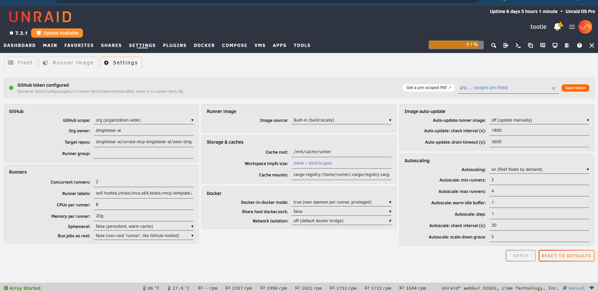
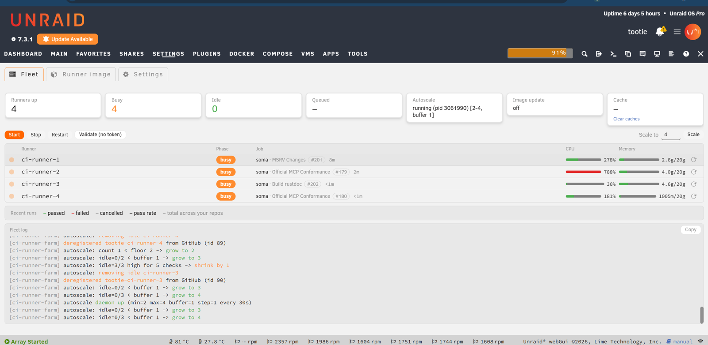
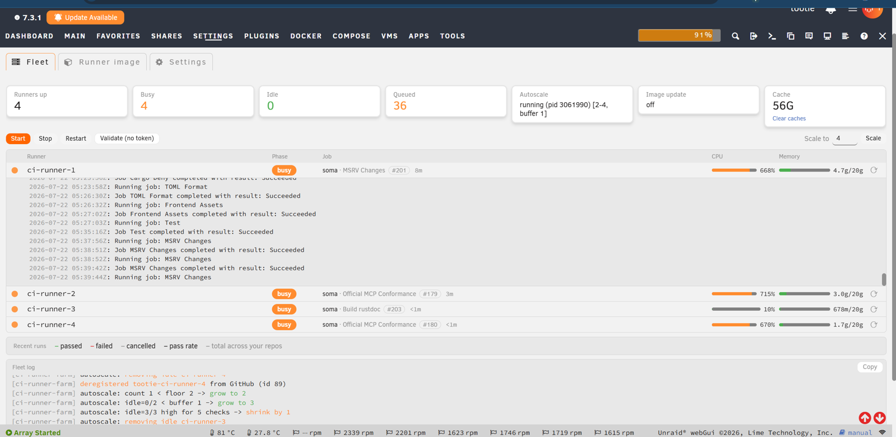

# CI Runner Farm for Unraid

## Worktree setup

The repository pins its build toolchain in `.mise.toml`. Prepare an existing
checkout (including a detached checkout) before building:

```bash
scripts/worktree-setup.sh
```

Create a fully prepared worktree from the current `origin/main`:

```bash
scripts/worktree-setup.sh codex/my-change
```

The setup is idempotent: it trusts the repository config, installs all pinned
tools, and verifies Go, Elixir, Erlang/OTP, and Mix before returning success.

Turn your Unraid server into a fleet of **GitHub Actions self-hosted runners**.
The distributed backend runs one-job GitHub scale-set runners across
authenticated Linux, Windows, WSL, and Unraid container nodes. The guarded
Fleet migration can replace classic production admission without interrupting
busy jobs, while retaining the classic engine as a supported rollback mode.
No VM is required for the Unraid container node.

Hosted CI minutes are slow and metered. Meanwhile, the Unraid server in your
rack has spare cores and a fast cache pool sitting idle between media tasks.
Point CI Runner Farm at a repo or organization, paste a token, and your builds
run on your own hardware — as many in parallel as your box can handle, with
dependency caches that stay hot between runs, at zero cost per minute.

---

## Why run your own CI?

- **Cost.** Hosted CI bills by the minute. A server you already own runs builds
  for the price of the electricity.
- **Speed.** Run many jobs in parallel, keep pnpm/npm/yarn/Playwright caches
  warm on a local NVMe pool, and reuse Rust compiler artifacts through Kache,
  sccache, or another concurrency-safe backend.
- **It's the Unraid thing to do.** Self-hosted runners are just Docker
  containers, and Docker is what your server is already great at. This is "do
  more with the hardware you have," turned up to a build farm.
- **A couple of clicks to install.** It's a normal plugin from Community
  Applications, configured entirely from the webGUI.

---

## What you get

| Capability | What it means |
|---|---|
| **N concurrent runners** | Each runner is its own container, optionally capped with `--cpus` / `--memory` so CI never starves the rest of the host. |
| **Runner pools** | Reserve independently scaled Rust, Python, TypeScript, or other capacity behind derived `ci-pool-*` labels so quick jobs do not wait behind long builds. |
| **Distributed scale sets** | Route one-job JIT runners across mTLS-authenticated heterogeneous nodes. The controller admits real CPU/memory reservations before advertising GitHub capacity. |
| **Utilization-aware autoscaling** | An optional daemon maintains a warm idle buffer between a min and max, independently for every configured pool. |
| **Warm shared caches** | npm, yarn, pnpm, and Playwright caches live on a fast pool and are reused across every run. Writable Cargo registry/git directories stay runner-local because concurrent extraction into one shared tree can corrupt dependencies; compiler artifacts belong in Kache, sccache, or another concurrency-safe backend. |
| **Docker-in-Docker per runner** | Jobs that use `services:` or `docker compose` just work, with an optional shared pull-through registry mirror so images are pulled once for the whole fleet. |
| **Bring your own image** | Point at any image you publish to a registry, or build one in-plugin — toggle **Rust / Python / Node·TS / Android** toolchains into the Dockerfile with one click, then Build. |
| **Live fleet dashboard** | Watch each runner's phase, the repo and **PR # it's building right now**, and live CPU/memory against its cap — plus queue depth, cache usage (one-click clear), recent-run pass rates, per-runner log drawers, and a colorized activity log. |
| **One webGUI page** | Three tabs — configure, build your image, run and watch the fleet — with your token stored securely on the host. No shell required. |

---

## How it works

The supported classic backend provisions persistent Docker containers from a
runner image built in-plugin or pulled from a registry. Each container registers
as a self-hosted runner at repository or organization scope.

The distributed backend uses GitHub runner scale sets for demand, a
central controller for durable admission and placement, and mTLS node agents for
execution. Scale-set jobs route by the pool's single custom label (for example
`runs-on: ci-pool-rust`), not by a classic multi-label array containing
`self-hosted`, OS, and architecture. OS, architecture, backend, capabilities,
CPU, and memory are controller policy and are checked before a JIT runner is
started. Tootie's distributed node keeps binary, configuration, TLS material,
state, and logs on the configured cache dataset; high-churn node runtime never
runs from or writes to the Unraid flash device.

Migration is deliberately non-disruptive: the Fleet gate proves compatibility
and remote ownership, stops new classic admission, waits for busy classic jobs
to drain, and only then makes scale sets effective. Do not manually delete
classic runners or claim cutover from registered nodes alone: completion
requires `scaleset_active` plus zero classic registrations and containers.

Persistent package caches and the build workspace are bind-mounted from a fast
pool so they survive across jobs. An optional companion container runs a
**pull-through registry mirror**, so Docker-in-Docker jobs across the whole fleet
pull each image only once. An optional autoscaler observes live busy, idle, and
starting runners, scaling each pool toward its configured warm-idle buffer and
back down after a grace period. The queued tile is a separate count of queued
workflow runs across configured repositories; it is not the autoscaling signal.

---

## Install

### Community Applications (recommended)

Search for **CI Runner Farm** in [Community Applications](https://unraid.net/community/apps)
and click **Install**.

### Install by URL

In the Unraid webGUI go to **Plugins → Install Plugin** and paste:

```
https://github.com/unraid/ci-runner-farm/releases/latest/download/ci-runner-farm.plg
```

Unraid always resolves this to the newest published release, and its built-in
"check for updates" keeps the plugin current.

---

## Setup, step by step

Everything lives on one page — **Settings → Utilities → CI Runner Farm** — split
into three tabs: **Fleet** (run and watch, the default view), **Runner image**
(build), and **Settings** (configure). The steps below follow setup order, so
they start on the **Settings** tab (rightmost). You'll need a GitHub Personal
Access Token and a fast pool/share for caches.

### 1. Configure the fleet — the *Settings* tab

The Settings tab holds the whole configuration on one screen:

- **GitHub** — pick your **scope** (`repo` or `org`), the **owner** and **target
  repos**, and an optional **runner group**.
- **Runners** — choose the legacy single fleet or define routed **runner pools**
  with their own fixed/min/max/idle capacity. Pools receive derived labels such
  as `ci-pool-python`. CPU/memory caps remain global per runner.
- **Runner image** — the **Image source**: **Built-in** (build locally, below),
  or **Remote** to pull a named image, e.g. `ghcr.io/org/ci-runner-image:latest`
  (for a private image, set the registry server/username and save a registry
  token; for `ghcr.io`, a blank registry token reuses your GitHub token).
- **Storage & caches** — the **warm caches** (host-subdir → container-path
  mounts; defaults cover pnpm/npm/yarn/Playwright) and the **workspace tmpfs
  size**. Keep writable Cargo registry/git state runner-local.
- **Docker** — **Docker-in-Docker** mode, host-socket sharing, and network
  isolation.
- **Autoscaling** and **image auto-update** — optional; see steps below.

Save your **Personal Access Token** from the band at the top (`repo` scope; add
`admin:org` for org runners). It's stored at
`/boot/config/plugins/ci-runner-farm/token` with `chmod 600` and is **never**
written into your plugin config — the **Get a pre-scoped PAT** link opens GitHub
with exactly the right scopes pre-filled.



### 2. Build a runner image — the *Runner image* tab

Point CI at any registry image, or build one right here. The Runner image tab is
a syntax-highlighted, in-page Dockerfile editor over a generic
[starter image](src/usr/local/emhttp/plugins/ci-runner-farm/default.Dockerfile)
(stock self-hosted runner base + a Docker-in-Docker readiness wrapper). Click the
**toolchain** pills — **Rust**, **Python**, **Node / TS**, **Android** — to
splice matching install blocks in or out, then **Save + Build Candidate** and watch
the live build log. A successful build receives an immutable candidate tag bound
to the Dockerfile SHA-256 and Docker image ID. The production
`ci-runner-farm-runner:latest` tag does not move until **Promote Verified
Candidate** rechecks that exact image ID. The Rust preset includes stable Rust,
Clippy, rustfmt, native build tooling, and a verified prebuilt `sccache`
configured as `RUSTC_WRAPPER`. Restart the fleet to roll onto the promoted
image. No registry needed.

Dockerfiles may deliberately use a host-local base such as
`local/github-runner:ubuntu-resolute`. That image must already exist on the
Unraid host. The builder checks literal `local/...` bases before invoking
BuildKit and reports the missing image directly; it never treats Docker Hub
authentication failure as a successful local build. A candidate still requires
explicit image-ID verification and promotion before the production tag moves.


### 3. Run and watch — the *Fleet* tab

The Fleet tab is mission control. **Validate** (no token needed) confirms the
host can provision, then **Start / Stop / Restart / Scale** the fleet and watch
live per-runner status: phase, the **repo and PR # each runner is building right
now** (linked to the GitHub run), and live **CPU / memory** against each runner's
cap. Click the ↻ on a runner to **recycle** it — deregister, remove, and bring
back a fresh replacement in place, so the fleet keeps its size.

The stat tiles track runners up / busy / idle, queued GitHub **workflow runs**, autoscaler
state, image-update state, and total **cache** usage — with a one-click **Clear
caches**. A **Recent runs** strip summarizes pass/fail/cancel rates across your
repos, and the colorized **Fleet log** streams autoscaler and action output.



Click any runner to drop down a live **log drawer** streaming that container's
job output inline:



### 4. (Optional) Routed runner pools

Runner pools solve head-of-line blocking by reserving eligible capacity. In
**Settings → Runners**, select **Runner pools** (organization scope is required)
and define records such as Rust 3, Python 1, and TypeScript 1. Each pool shows a
copyable workflow selector:

```yaml
# Rust
runs-on: ci-pool-rust

# Python
runs-on: ci-pool-python

# TypeScript / Node
runs-on: ci-pool-typescript
```

GitHub matches every requested label. A job that asks only for `self-hosted`
can still use any self-hosted runner, and a specialized runner carrying a broad
legacy label such as `unraid` would still accept generic jobs. Pool-mode runners
therefore receive only their derived custom routing label. Migrate every
self-hosted workflow job to an explicit `ci-pool-*` selector before removing the
legacy/general capacity.

Pools are scheduling routes, not trust boundaries. They share the host kernel,
runner image, network policy, privileged DinD setting, and writable caches.
Runner groups remain the organization-level repository access boundary.

Safe activation order:

1. Deploy the plugin while **Single fleet** remains selected.
2. Restart the single fleet once after upgrading so existing containers receive
   immutable GitHub scope metadata before any mode change.
3. Prepare Rust/Python/TypeScript pool definitions.
4. Update workflow jobs to their unique selectors.
5. Enable pool mode and verify each GitHub registration and smoke job.

Pool runners carry only their derived `ci-pool-*` custom label, so they cannot
stand in for jobs that still request legacy custom labels such as `unraid` or
`build`. Keep external legacy-compatible capacity online during the handoff if
you need a zero-queue migration; otherwise expect a short queued interval between
the workflow-label update and enabling pool mode. Jobs requesting only
`self-hosted` remain eligible for any online self-hosted runner.

The plugin never edits workflow files in sibling repositories. Routing changes
are an explicit, repository-by-repository migration owned by those workflows.

Rollback in the opposite order: restore legacy workflow selectors first, wait
for those workflow changes to land, then switch back to Single fleet. Switching
the controller first leaves jobs targeting `ci-pool-*` queued.

### 5. (Optional) Utilization-aware autoscaling

On the Settings tab, set a **min** and **max** runner count, a **warm idle
buffer**, an **autoscale step**, a **demand check interval**, and a **scale-down
grace** period. In pool mode, every pool has its own min/max/buffer while the
step, interval, and grace are global. The daemon grows a pool when running jobs
consume its warm idle capacity and removes only explicitly idle runners after
the grace window. Every autoscaled pool requires a minimum of at least one:
this release intentionally does not enumerate queued jobs by label or scale
from zero. Its decisions stream into the Fleet log.

Once started, the runners also show up as ordinary Docker containers
(`ci-runner-1…N` in single mode or `ci-runner-<pool>-N` in pool mode), plus the optional `ci-runner-mirror` registry mirror — each
with the warm-cache bind mounts you configured — register with GitHub, and start
picking up jobs.

## Distributed runner farm

The optional distributed control plane extends the Unraid container farm with
portable Linux and Windows nodes. One Elixir controller owns GitHub scale-set
demand, Rust scheduling, placement state, and mTLS node sessions. Each Rust node
advertises an explicit resource budget and exactly one execution backend:

- `native_process` runs a pinned GitHub runner package directly on Linux or
  Windows and contains cancellation to a Unix process group or Windows Job
  Object;
- `container` delegates an approved placement to the local Unraid adapter,
  which reuses the plugin's resource, identity, cache, and Docker lifecycle
  controls.

The GitHub PAT or App key remains in the central scale-set adapter. Nodes receive
only a one-shot JIT descriptor over TLS 1.3 mutual authentication. Durable node
state never stores that descriptor.

The **Runners** page separates the external control plane from the local Unraid
node. It shows controller freshness, every registered node and platform, total
and free capacity, active offers/placements, pool-session health, and the local
node's execution backend, generation, and cache-backed storage. The controller
projection is secret-free, capability-gated, delivered over the existing mTLS
node session, and atomically stored beneath the cache-resident node tree with
mode `0600`. The page never opens or tunnels controller RPC and never runs the
controller from Unraid flash.

Mutations remain on the controller's authenticated local operator channel:

```sh
/opt/ci-runner-farm/current/bin/crf-operator-status status
/opt/ci-runner-farm/current/bin/crf-operator-status drain NODE GENERATION
/opt/ci-runner-farm/current/bin/crf-operator-status undrain NODE GENERATION
/opt/ci-runner-farm/current/bin/crf-operator-status force-abandon PLACEMENT --force
```

On Unraid, the optional node is deliberately installed under
`/mnt/cache/appdata/ci-runner-farm/distributed-node`. Its executable, TLS files,
configuration, state, and logs do not run from or write to flash. Only ordinary
plugin configuration/package persistence uses `/boot`; the process PID lives in
tmpfs. Docker start/stop event hooks start and stop the cache-resident node.

Distributed activation is fail-closed. The migration gate cannot activate until a
fresh live compatibility operation proves the exact plugin/helper/module/image
identity, restricted runner groups, assigned-job accounting, zero-to-one scale,
cancel/reassign, acknowledgement replay, nested-cgroup charging, classic
quarantine, and exact cleanup. Changing any bound artifact invalidates the
record. Rollback makes scale sets ineligible before restoring classic admission.

Full architecture, configuration, packaging, certificates, current deployment
evidence, fleet-qualification runs, and residual hardening work live in
[`docs/distributed-runner-farm/`](docs/distributed-runner-farm/README.md).

---

## Security

Self-hosted runners execute arbitrary workflow code on your hardware. Read this
before exposing the fleet:

- DinD runners run `--privileged`, and the shared-socket mode gives runners
  root-equivalent access to the host. Use self-hosted runners **only for
  trusted/private repositories**. Fork-PR code from public repos must **never**
  run on a privileged or socket-mounted self-hosted runner.
- **The plugin actively warns you.** When you Start the fleet (and live on the
  settings page), it checks each repo-scope target's visibility via your token
  and shows a prominent warning if any is **public** while runners are
  privileged. It warns rather than blocks — the call stays yours.
- **`Share host docker.sock` now defaults to off.** Turn it on only for trusted
  private repos; DinD (the default) already covers `services:` without it.
- **Your GitHub token never enters a runner container.** The PAT stays on the
  host; each runner is handed only a short-lived registration token, and runners
  are deregistered host-side. So a workflow step can't read your token out of its
  own environment.
- **Network isolation** (Docker section) confines runners at the network layer:
  - `isolate` puts them on a dedicated bridge so they can't reach your **other
    Unraid containers**;
  - `strict` adds firewall rules (Docker's `DOCKER-USER` chain) that also block
    the runners from the **Unraid host and your LAN**, while still allowing the
    internet and the shared image cache. Recommended if runners might touch
    less-trusted code. Applies on the next Start; needs `iptables` on the host.
- For stronger isolation, set `EPHEMERAL=true` so each job gets a clean runner.
- At org scope, create a **runner group restricted to your private repos** so a
  public repo can never schedule onto these runners.
- Runner pool labels route jobs but do not authorize repositories. V1 uses the
  same global runner group for every pool.

See GitHub's [self-hosted runner security guidance](https://docs.github.com/en/actions/hosting-your-own-runners/managing-self-hosted-runners/about-self-hosted-runners#self-hosted-runner-security)
for the full picture.

---

## CLI

Everything in the UI maps to the control script:

```
include/runner-farm.sh {start|boot-autostart|stop|restart|scale [pool] N|status|status-json|readiness-json|distributed-status-json|distributed-pools-json|compatibility-start|begin-migration|rollback-backend|logs i|validate|validate-pools|build-image|build-status|promote-image TAG IMAGE_ID|mutation-owner-{claim|status|release}|prune-cache|autoscale-*}
```

Use a mutation-owner lease when an operator or automation needs several fleet
mutations to remain exclusive:

```sh
owner="maintenance-$(date +%s)"
include/runner-farm.sh mutation-owner-claim "$owner" 1800
CRF_MUTATION_OWNER="$owner" include/runner-farm.sh reconcile-config
CRF_MUTATION_OWNER="$owner" include/runner-farm.sh recycle ci-runner-rust-1
include/runner-farm.sh mutation-owner-release "$owner"
```

While the lease is active, competing mutations fail and background mutation
ticks skip their pass. Read-only status remains available.

---

## Releases & versioning

Releases are automated with
[release-please](https://github.com/googleapis/release-please) and published as
**GitHub Release assets** — the same flow used by Unraid's other plugins.

- `.release-please-manifest.json` is the SemVer source of truth; `VERSION`
  mirrors it for tooling.
- Merging [Conventional Commits](https://www.conventionalcommits.org) to `main`
  opens a release PR. That PR regenerates the self-contained
  `ci-runner-farm.plg` (version entities + embedded payload) and updates
  `CHANGELOG.md`.
- Merging the release PR tags `vX.Y.Z`, cuts a GitHub Release, validates the
  tagged `.plg`, and uploads it as the `ci-runner-farm.plg` release asset that
  the install URL above resolves to.

The Unraid plugin-manager `<version>` is written as
`YYYY.MM.DD.HHMM.BUILD-INTERNAL` (e.g. `2026.06.24.1530.42-0.1.0`) so it sorts
chronologically in the plugin manager while still pinning the SemVer release.

---

## Development

```sh
./build-plg.sh                 # build ci-runner-farm.plg from src/ (date-stamped dev build)
./deploy.sh root@tower         # rsync src/ to a dev Unraid host (fast iteration; not for installs)
```

The `.plg` is fully self-contained: the plugin file tree is tarred,
base64-encoded, and embedded inline, so installing only ever fetches the single
`.plg` — no external file hosting.

### Layout

```
ci-runner-farm.plg                 self-contained installer (built artifact, committed)
build-plg.sh                       packages src/ -> versioned .plg
deploy.sh                          dev-only raw deploy to an Unraid host
release-please-config.json         release-please configuration
.release-please-manifest.json      SemVer source of truth
VERSION                            mirror of the internal SemVer version
src/usr/local/emhttp/plugins/ci-runner-farm/
  RunnerFarm.page                  Settings page (Dynamix)
  default.cfg                      seed config
  default.Dockerfile               generic starter runner image
  include/runner-farm.sh           provisioning/control script
  include/exec.php                 CSRF-guarded web endpoint
.github/workflows/
  package-plugins.yml              PR/branch build + validate
  release-please.yml               release automation + asset upload
  release.yml                      tagged-release validation
```

---

## Support

Questions and bug reports: <https://github.com/unraid/ci-runner-farm/issues>
